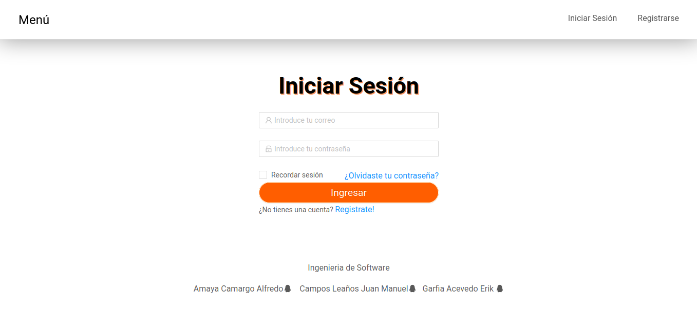
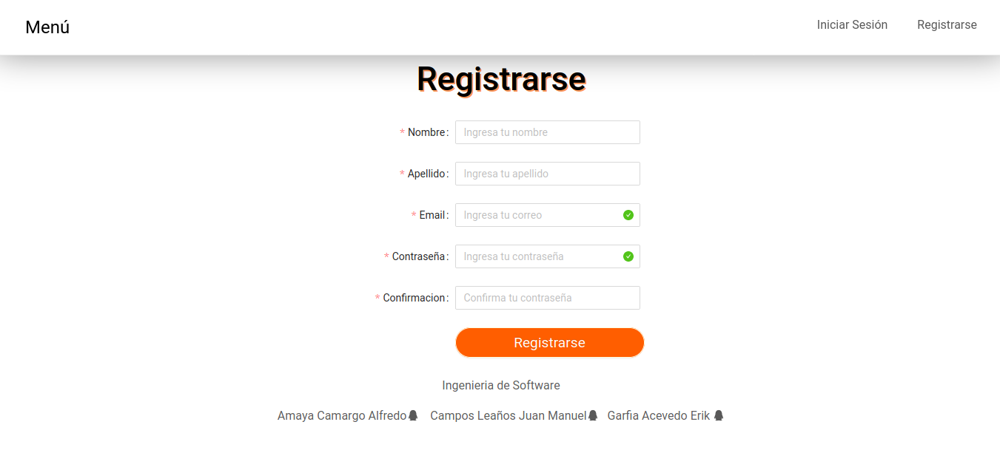
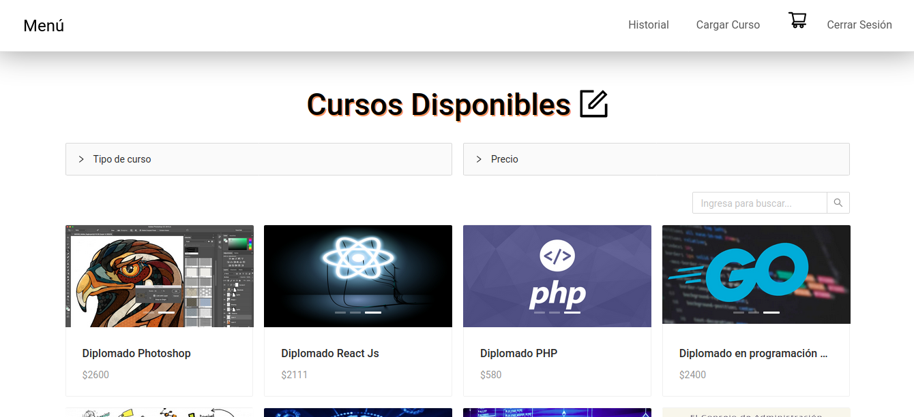
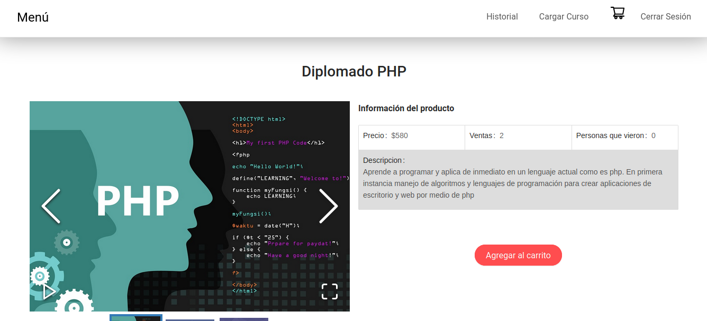
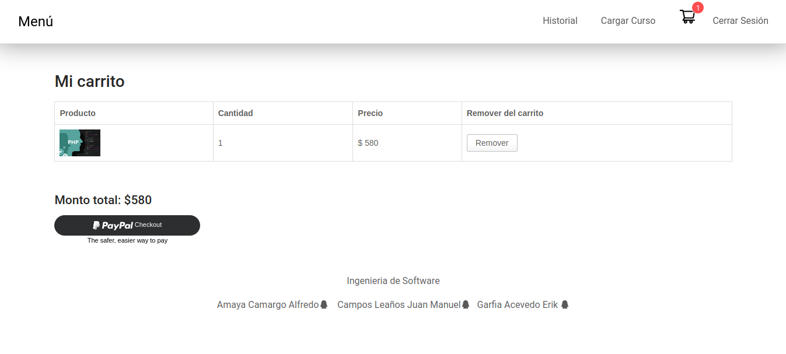

# COURSES-SHOP

Project created to show a variety of courses managed by a main user, adds a registry and a user of users. Add, delete, purchase and modify courses, includes a shopping cart integrating Paypal API.

## Starting 🚀

Open a new terminal
> git clone https://github.com/ErikGarfia/Courses-Shop.git

>cd **PAGOSG**

>npm install

>cd client

>npm install

>cd ..

>npm run dev

> You should configure your MongoDB Atlas keys in /server/config/dev.js
## Screenshots ⚙️

  

  

  

  

  

## Construido con 🛠️

* React JS
* Node JS
* MongoDB Atlas
* Bootstrap

## Autores ✒️

* **Garfia Acevedo Erik** 

## Licencia 📄

Este proyecto está bajo la Licencia GNU General Public License v3.0 - mira el archivo [LICENSE.md](LICENSE.md) para detalles

## Expresiones de Gratitud 🎁

* Comenta a otros sobre este proyecto 📢
* Espero te sea de utilidad 🤓.

---
⌨️ con ❤️ por [ErikGarfia](https://github.com/ErikGarfia) 😊
